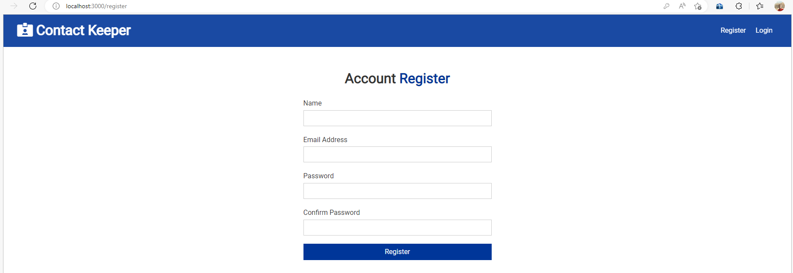
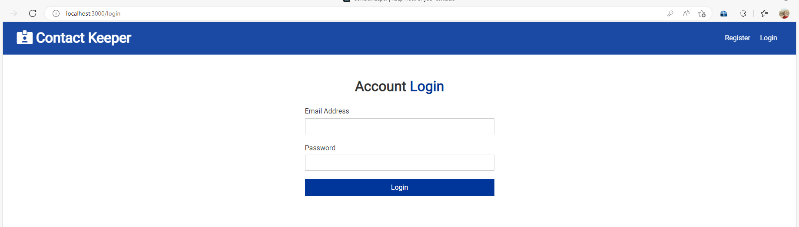
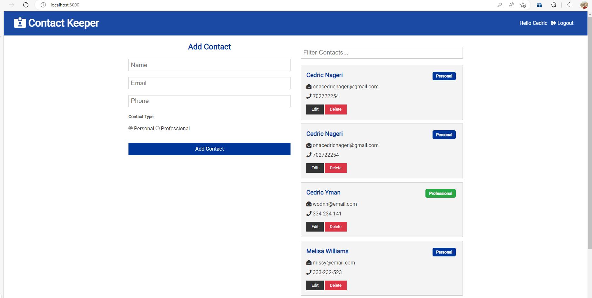

# Contact Keeper application.

This application is developed using ReactJS for the frontend and NodeJS, Express and Mongo for backend. (MERN stack).

To run the application :-

Start by deleting the `package-lock.json` file and install the dependancies in the `package.json` file.

- Install the dependancies:

```
npm install
```

Set the environment variables in the `.env` file.

```
MONGODB_URI=""
jwtSecret=""
NODE_ENV="development"
```

- Start the server for both client and server, in development:

```js
npm run dev
```

- Register Screen
  
- Login Screen
  
- Home Screen Showing contacts of the logged in User.
  
